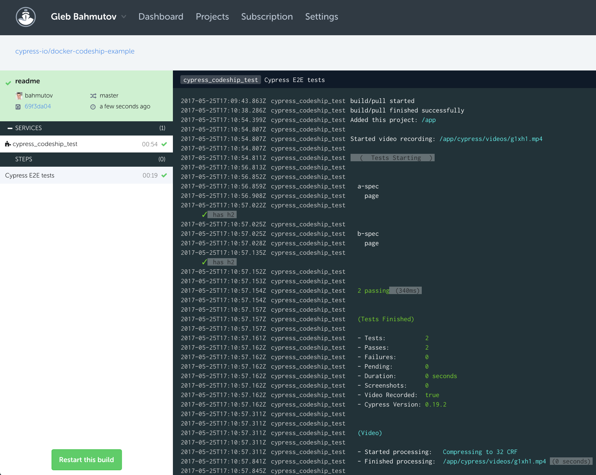

> Cypress + Docker + Codeship = ❤️

Running your Cypress E2E tests on Codeship Pro CI is very simple.
You can either start with a base image
[cypress/base](https://hub.docker.com/r/cypress/base/)
or with an image that already includes Cypress tool
[cypress/internal](https://hub.docker.com/r/cypress/internal/).

1. Create test image

Use [Dockerfile](Dockerfile) to build a test image

If you use `cypress/internal:cy-...` image, the Cypress will be installed
globally, and you just need to copy the source and test files.

```
# follows Codeship Node example
# https://documentation.codeship.com/pro/languages-frameworks/nodejs/
FROM cypress/internal:cy-0.19.2
WORKDIR /app
# Copy our test page and test files
COPY index.html ./
COPY cypress.json ./
COPY cypress ./cypress
```

If you use `cypress/base` image you would need to install Cypress tool too.

```
FROM cypress/internal:cy-0.19.2
RUN npm install -g cypress-cli
RUN cypress install --cypress-version 0.19.2
WORKDIR /app
# Copy our test page and test files
COPY index.html ./
COPY cypress.json ./
COPY cypress ./cypress
```

2. Define Codeship build step

Use [codeship-services.yml](codeship-services.yml) file to
build `cypress/cypress_codeship_test` image (from the above Dockerfile).

```yaml
cypress_codeship_test:
  build:
    image: cypress/cypress_codeship_test
    dockerfile: Dockerfile
```

3. Define test steps

Use [codeship-steps.yml](codeship-steps.yml) file to use the built image
and run one or more E2E tests in parallel or in sequence.

```yaml
- name: "Cypress E2E tests"
  service: cypress_codeship_test
  command: cypress run
```

Now push the changes to the repo, and watch Codeship run



## Happy testing

If you find problems with Cypress and CI, please

- consult the [documentation](https://on.cypress.io)
- ask in our [Gitter channel](https://gitter.im/cypress-io/cypress)
- find an existing [issue](https://github.com/cypress-io/cypress/issues)
  or open a new one
